# 使用cloudflare实现无限域名邮箱
最近签到的项目做的有点多了，gmail最近也风控的非常厉害！

## 1、注册域名
邮箱是需要用到域名的，所以我们去注册域名：
这里不推荐任何渠道，只是列出dandan常用的：

https://cn.resellerclub.com/domain-names

为什么推荐resellerclub，老牌子。主要不用备案，还可以隐藏注册信息！

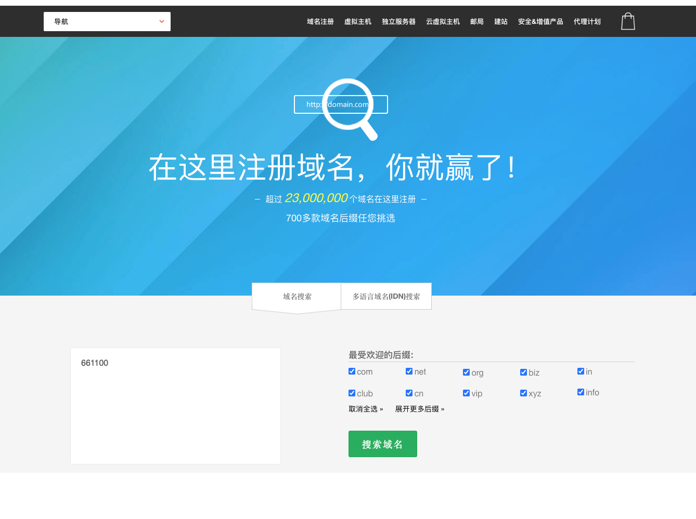

全部域名一起查询会有点慢，所以要等等！我们也可以指定后缀的域名，一般便宜的都会列出来！

``.cc的域名是国际公司商务域名，你们懂的！``

``.website一般是个人blog``

``.site 一般blog也用的多``

``.tech 科技公司用的多``

``.online 垃圾站用的多``

``.store 垃圾站用的多``

``.live 视频和直播站用多``

``.fun 不知道反正便宜``


这里推荐20块以下可以注册多个，
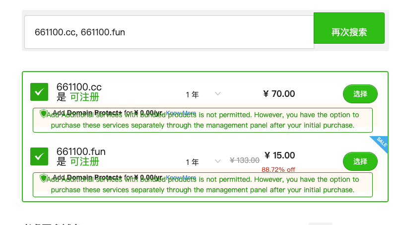

## 2、设置域名

付款成功以后会收到一个邮件通知，邮件有个控制面板登录地址：

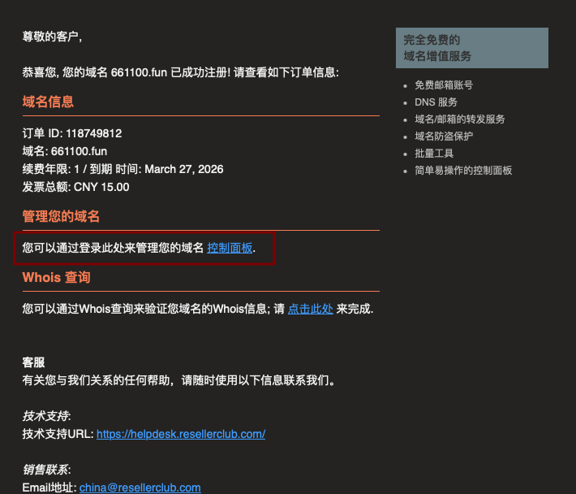

进入控制面板：

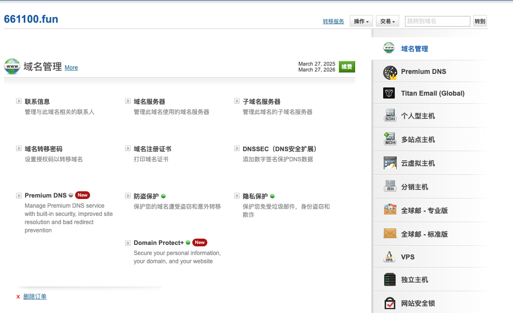


## 2、注册cloudflare
这里网上很多教程，告诉你怎么注册，也是简单的3步。我这里就不多打字了！
注册地址：cloudflare.com


## 3、在cloudflare登记你刚才注册的域名


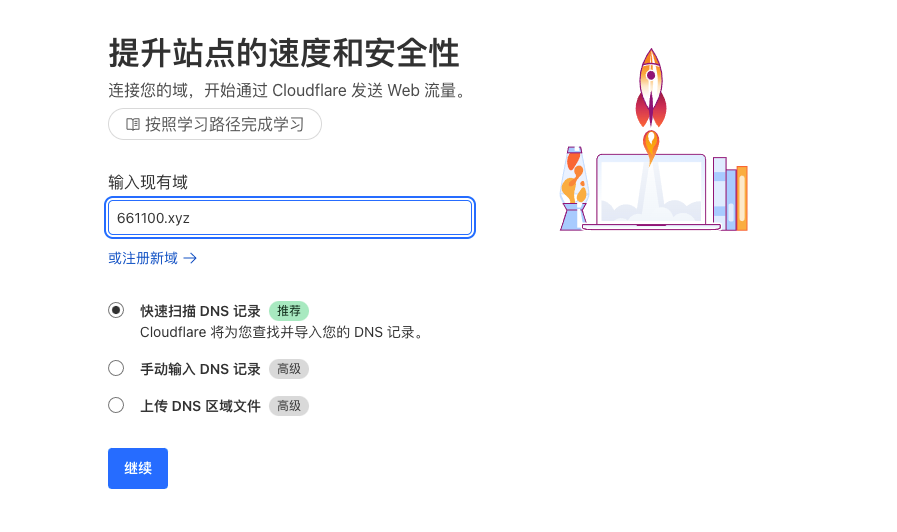

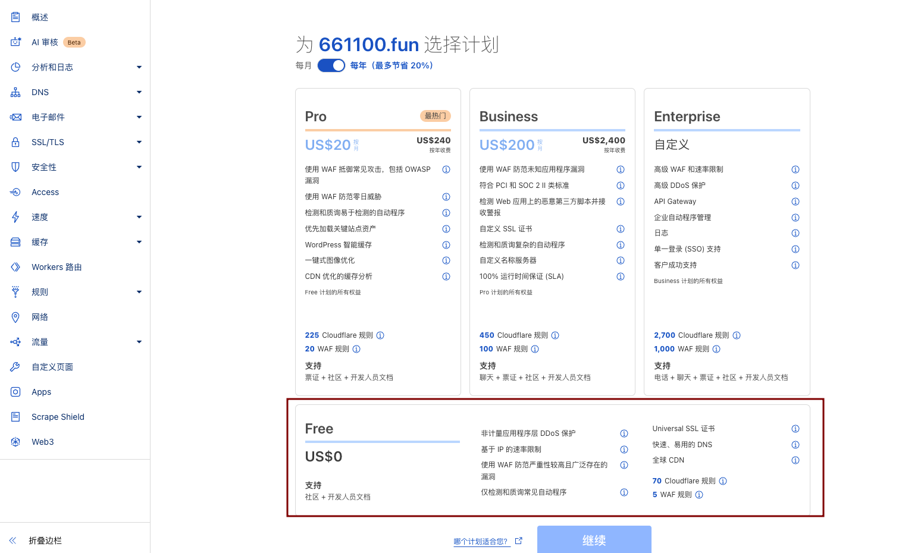

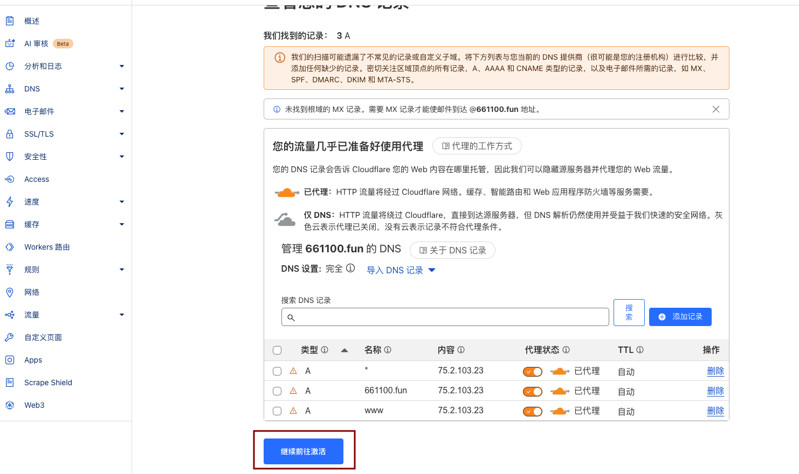

我们这里开始要设置DNS很重要仔细看！


我们把第3步的信息放到，我们刚才注册的那个网站。

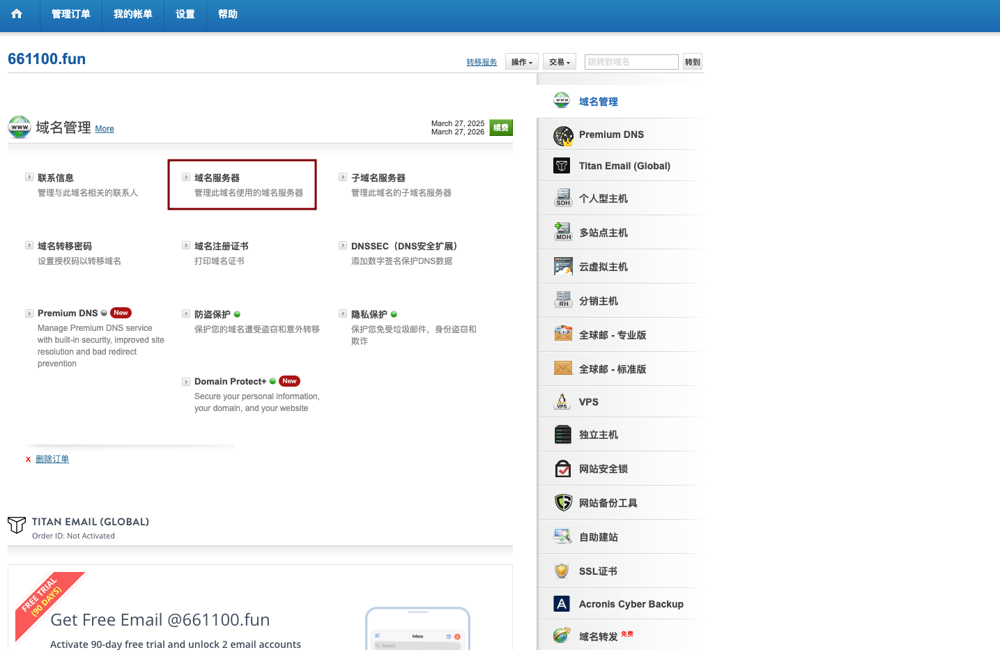

讲cf里面的dns复制到这里
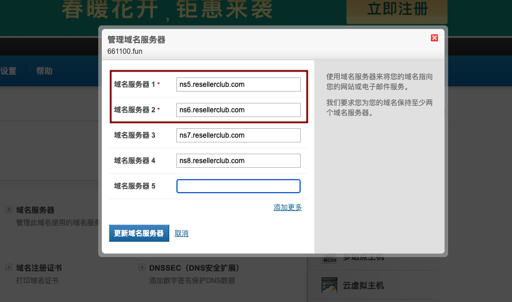

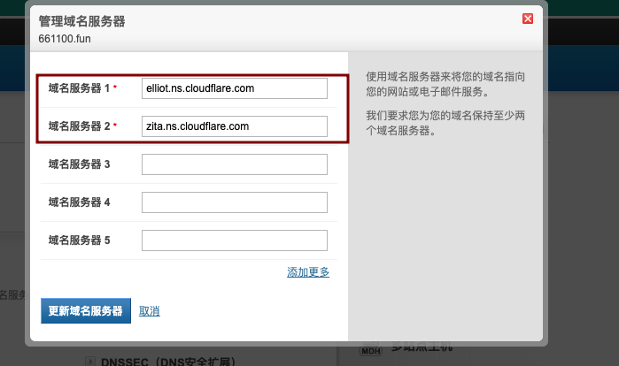

然后点击更新域名服务器

设置好了，我们在cf继续。

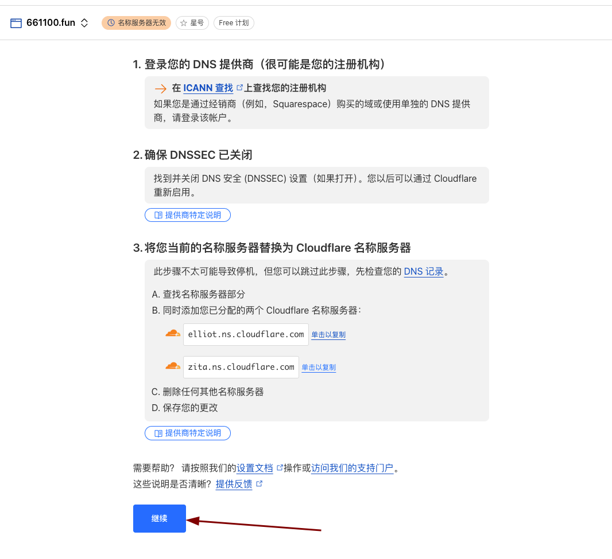


## 4、设置企业邮件
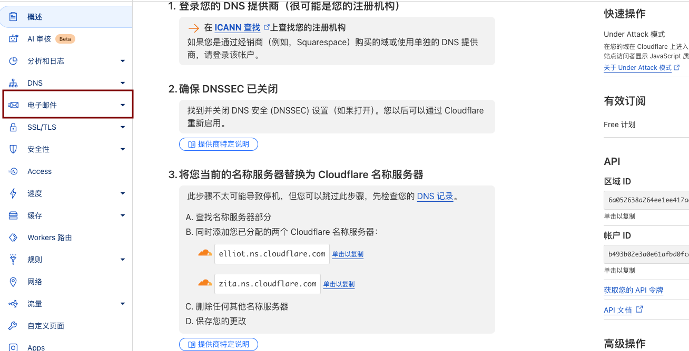

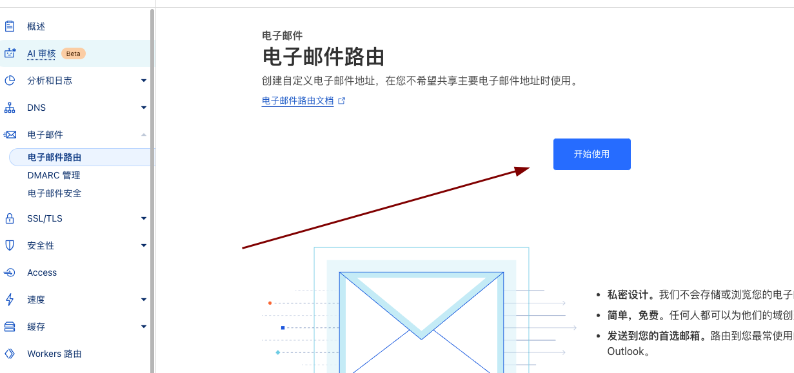

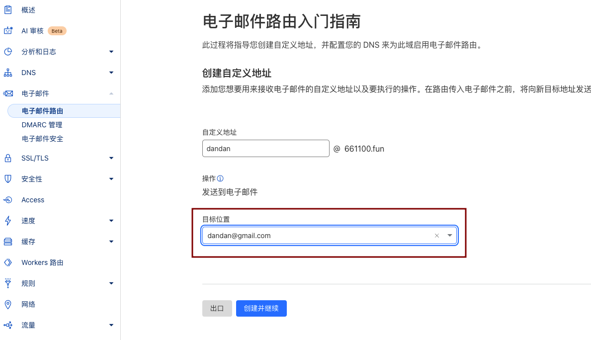

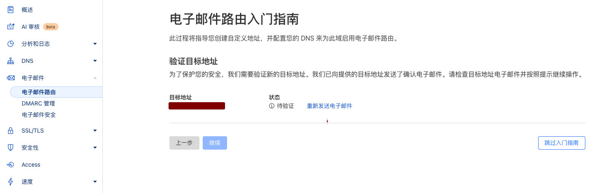

收到邮件验证一下！

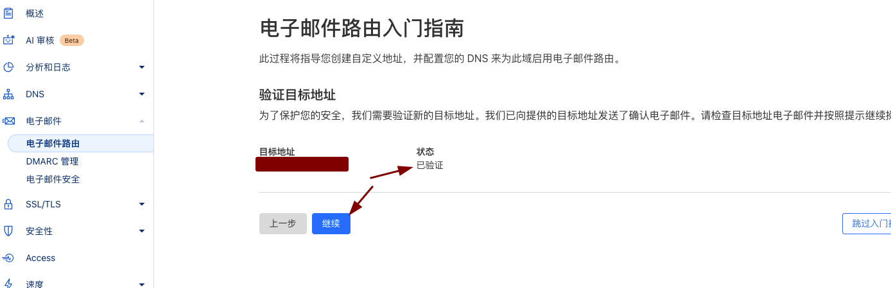

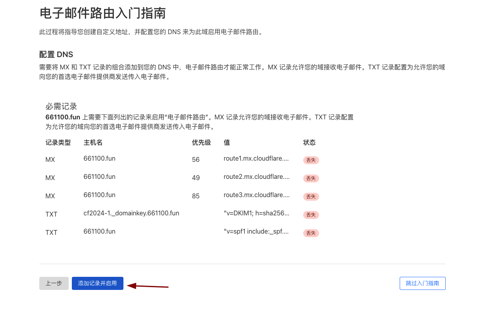

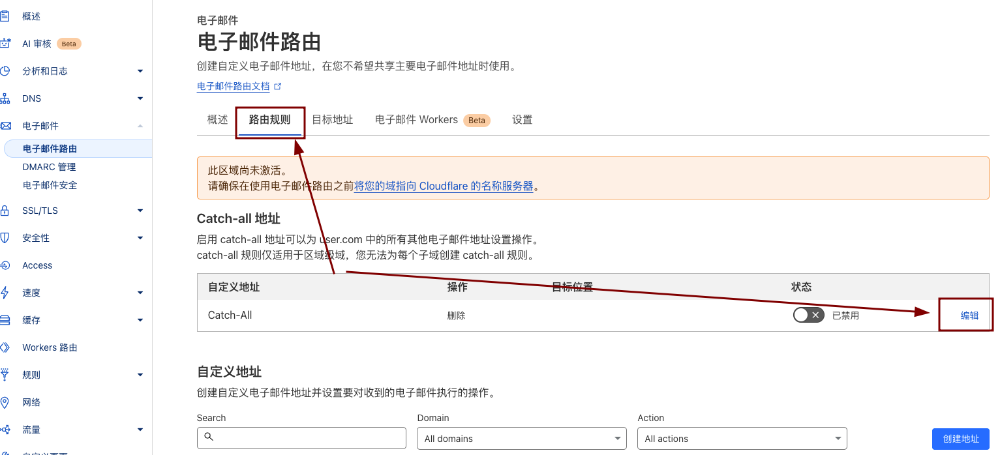

添加你的收件地址
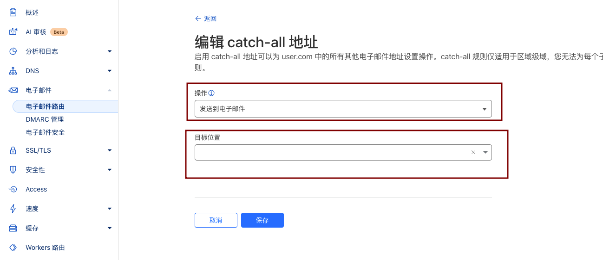


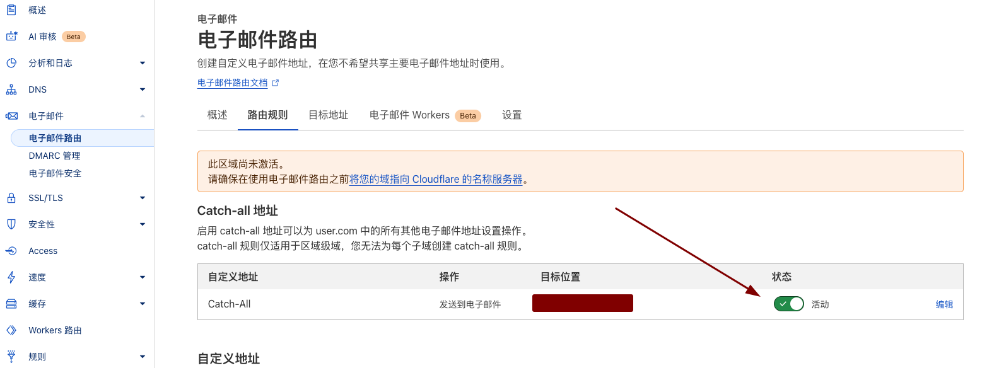

这样就完成了！

## 5、怎么使用？
1-4步骤做完了，我们就拥有一个无限邮箱的域名。

很多人问题应该是怎么开邮箱，告诉你不用。

你所有的关于(xxx@661100.fun)的邮箱，都会转发到你的gmail里面去。

脚本怎么使用呢？遇到批量注册对邮箱没要求的项目，那么你冲几万个号都没问题！

例如dandan的脚本：
```txt
xxxx01@661100.fun||||1234567
xxxx02@661100.fun||||1234567
............................
xxxx10000@661100.fun||||1234567
```

就这么简单！


## 6、扩展功能？
一般项目方不会要求你发邮件的，如果遇到这样的项目方，dandan到时来写脚本！
